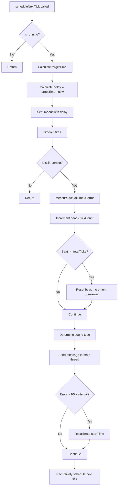

# Metronome Worker Timing Algorithm

## 📋 Overview

The `scheduleNextTick()` function in `metronomeWorker.ts` implements a precise timing algorithm for metronome ticks. This document explains the algorithm, its design decisions, and how it maintains accuracy across different devices and conditions.

## 🎯 Core Problem

Traditional metronome implementations using `setInterval` or recursive `setTimeout` suffer from **drift accumulation** - small timing errors compound over time, causing the metronome to become increasingly inaccurate.

## 🔧 Algorithm Design

### **State Variables**

| Variable | Type | Purpose |
|----------|------|---------|
| `startTime` | `number` | Absolute reference time when metronome started |
| `tickCount` | `number` | Number of ticks since start (0-indexed) |
| `interval` | `number` | Milliseconds between ticks: `60000 / bpm / subdivision` |
| `targetTime` | `number` | Calculated ideal time for next tick |

### **Key Concepts**

#### 1. **Absolute Time Reference**
Instead of scheduling relative to the last tick (`lastTick + interval`), we calculate an **absolute target time** from the start:

```
targetTime = startTime + (tickCount * interval)
```

This prevents error accumulation because each tick's timing is calculated independently from the reference start time.

#### 2. **Error Measurement & Correction**
After each tick executes, we measure the actual execution time and compare it to the target:

```
actualTime = performance.now()
error = actualTime - targetTime  // Positive = late, Negative = early
```

If the error exceeds 10% of the interval, we recalibrate the `startTime`:

```
if (Math.abs(error) > interval * 0.1) {
    startTime = actualTime - (tickCount * interval)
}
```

This allows the algorithm to recover from large timing disruptions (e.g., tab background throttling).

## 📊 Algorithm Flow



## 🔍 Detailed Step-by-Step

### **Step 1: Calculate Target Time**
```javascript
const targetTime = startTime + (tickCount * interval)
```
- `startTime`: Captured when metronome starts (`performance.now()`)
- `tickCount`: Increments with each tick (0, 1, 2, ...)
- `interval`: Fixed based on BPM and subdivision

### **Step 2: Schedule Execution**
```javascript
const delay = Math.max(0, targetTime - performance.now())
setTimeout(callback, delay)
```
- `Math.max(0, ...)`: Prevents negative delays (if already past target)
- Uses `performance.now()` for high-resolution timing

### **Step 3: Execute Tick & Measure Error**
```javascript
const actualTime = performance.now()
const error = actualTime - targetTime
```
- `error > 0`: Tick executed late
- `error < 0`: Tick executed early (rare, due to `Math.max(0, ...)`)
- `error ≈ 0`: Perfect timing

### **Step 4: State Updates**
```javascript
state.beat++                    // Current beat in measure (0-indexed)
state.tickCount++              // Total ticks since start

if (state.beat >= state.totalTicks) {
    state.beat = 0
    state.measureCount++       // Increment measure counter
}
```

### **Step 5: Error Correction**
```javascript
if (Math.abs(error) > state.interval * 0.1) {
    state.startTime = actualTime - (state.tickCount * state.interval)
}
```
- **10% threshold**: Only recalibrate for significant errors
- **Recalibration formula**: Adjusts `startTime` so future `targetTime` calculations align with actual execution

### **Step 6: Message to Main Thread**
```javascript
const message = {
    type: "tick",
    beat: state.beat,
    soundType: isAccent ? "accent" : "sub",
    timestamp: performance.now(),    // Actual execution time
    targetTime: targetTime,          // Ideal target time
    // ... other metadata
}
self.postMessage(message)
```

## 🎵 Sound Type Determination

```javascript
const initMeasure = state.beat === 0
const isAccent = initMeasure || state.beat % state.subdivision === 0
const soundType = isAccent ? "accent" : "sub"
```

- **Accent**: First beat of measure OR beats aligned with subdivision
- **Sub**: All other beats
- Example (4/4 time, subdivision=4): Beats 0, 4, 8, 12 = accent

## ⚡ Performance Considerations

### **Advantages**
1. **No drift accumulation** - Each tick independent
2. **Self-correcting** - Recovers from large errors
3. **Mobile-friendly** - Handles background throttling
4. **Deterministic** - Same timing regardless of execution variance

### **Limitations**
1. **`setTimeout` resolution** - Minimum ~4ms delay in browsers
2. **Background throttling** - Mobile browsers may limit to ~1Hz
3. **Clock skew** - `performance.now()` may have reduced resolution on mobile

## 🔄 Communication with Main Thread

### **Message Structure**
```typescript
interface MainMessage {
    type: "tick"
    beat: number                // Current beat (0-indexed)
    soundType: "accent" | "sub"
    timestamp: number          // Actual execution time (performance.now())
    targetTime: number         // Ideal target time for compensation
    measureCount: number       // Current measure (1-indexed)
    measuresOn: number         // Gap trainer: measures playing
    measuresOff: number        // Gap trainer: measures muted
    gapEnabled: boolean        // Whether gap trainer is active
}
```

### **Main Thread Compensation**
The main thread uses both `timestamp` and `targetTime` to:
1. Calculate communication latency: `latency = now - targetTime`
2. Schedule audio with compensation: `audioDelay = max(0, 0.05 - latency/1000)`
3. Play sound: `source.start(ctx.currentTime + audioDelay)`

## 🧪 Testing & Debugging

### **Error Metrics**
- **Ideal scenario**: `error ≈ 0-4ms` (setTimeout resolution)
- **Acceptable**: `error < interval * 0.1` (10% threshold)
- **Problematic**: `error > interval * 0.1` triggers recalibration

### **Common Issues**
1. **Large positive error**: Tab backgrounded, CPU throttled
2. **Consistent drift**: Clock skew, incorrect interval calculation
3. **Missing ticks**: Worker terminated, message queue overflow

## 📈 Example Calculations

### **120 BPM, 4/4 time, subdivision=4**
```
interval = 60000 / 120 / 4 = 125ms
totalTicks = 4 * 4 = 16 ticks per measure

Tick schedule (ms from start):
0, 125, 250, 375, 500, 625, 750, 875,
1000, 1125, 1250, 1375, 1500, 1625, 1750, 1875
```

### **Error Scenario**
```
startTime = 1000
tickCount = 5
interval = 125ms
targetTime = 1000 + (5 * 125) = 1625
actualTime = 1630 (due to throttling)
error = 1630 - 1625 = 5ms (4% error, no recalibration)
```

## 🔮 Future Improvements

1. **Adaptive threshold**: Dynamic error threshold based on BPM
2. **Predictive scheduling**: Anticipate throttling patterns
3. **Web Audio Clock**: Use `audioContext.currentTime` as reference
4. **Statistical correction**: Moving average of errors for finer adjustment

---

*Last Updated: 2025-01-11*  
*Algorithm Version: 2.0 (Absolute Time Reference)*